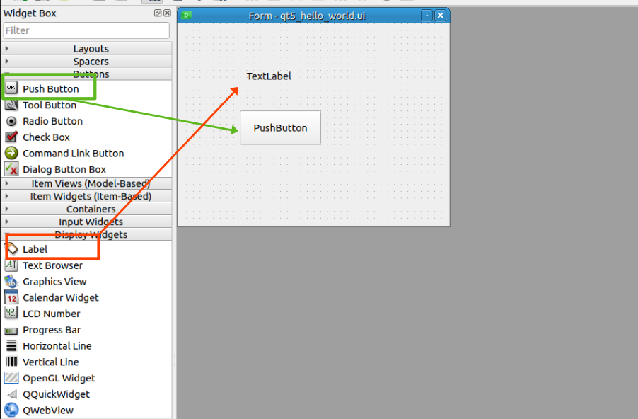

# 1. Qt5 Hello World!

ここでは、Qt5を使った簡単なプログラム作成例を示します。

## Qtとは

Qtは、C++でクロスプラットフォームのGUIアプリケーションを作成できるフレームワークです。

Qtは、以下のような特徴を持っています。

- クロスプラットフォーム : Windows, macOS, Linuxなど、様々なプラットフォームで動作します。
- オープンソース : LGPL版のOSSライセンスと商用ライセンスが提供されており、OSS版を動的リンクすることで、商用アプリケーションをコストを抑えつつ開発できます。
- 豊富な機能 : GUIアプリケーション開発に必要な機能が豊富に提供されています。

Qtを使用したアプリケーションは多岐にわたり、ROSのGUIツールにも使用されています。

## Qtのインストール

ここでは、Qt単体のインストールを行います。


### 今回使用する環境

- Ubuntu 22.04 LTS
- Qt 5 : ほとんどの場合、Qt4やQt6でも動作します
- Qt Designer 5.15.3
- VSCode （エディタ : お好みで）

### インストール方法 (Ubuntu)

```bash
sudo apt update
sudo apt install -y qtbase5-dev qttools5-dev-tools cmake g++
```

<br>

## Qt5 Hello Worldの作成

### ディレクトリ構造

まずは、次のようなディレクトリ構造を作成します。最上位のディレクトリを`qt5_hello_world`とします。


```bash
./
├── CMakeLists.txt
└── src
    ├── main.cpp
    └── qt5_hello_world.ui

1 directory, 4 files
```

```bash
mkdir -p qt5_hello_world/src
touch qt5_hello_world/CMakeLists.txt
touch qt5_hello_world/src/main.cpp
touch qt5_hello_world/src/qt5_hello_world.ui
```

### uiファイルの作成

Qtには、デザインツール「Qt Designer」があり、これを使用することでGUI上でウィジェットを配置することができ、ソースコードを自動で生成することができます。

基本は手書きで全く問題ないですが、デザインの記述はロジックとは別にしたいので、ここでは一貫してuiファイルを使用してUI定義を行います。

#### Qt Designerの起動

Ubuntuであれば、Windowsボタンを押して「Qt Designer」と入力すると、アプリケーションが表示されるので、クリックして起動します。


#### UIの作成

作成する対象を選択します。

MainWindowが多く使われますが、このチュートリアルは最終的にRvizと相互利用する小尾を想定しているので、「Widget」を選択します。


下のように編集画面が開きます。UIを作成します。


今回は、PushButtonとLabelを配置します。

それぞれ、左のウィジェットボックスからドラッグして配置します。



配置が終わったら、一旦保存します。

> [!NOTE]
> 保存の際は、他のエディタと同様に、`Ctrl + S`で保存できます。


<br>

次は、もっと細かな設定を行います。

右側のプロパティウィンドウから、オブジェクト名を設定します。


オブジェクト名は、後でソースコードからアクセスするための名前です。
デフォルトの名称でも被ることはないですが、わかりやすい名前に変更しておきます。

- Form (Widgetの名前) : `ExampleWidget`
- PushButton : `example_push_button`
- Label : `example_label`


> [!TIP]
> ExampleWidgetだけキャメルケースなのは、自動生成時にクラス名として使用するためです。


他にもさまざまな設定ができます。試してみましょう。

十分な機能が実装できたら、保存してQt Designerを閉じます。

<br>

### コードの作成

次は、いよいよ実装部分を作成します。

今回は、簡単のためにソースコードは `main.cpp` 1つのみとし、あとはビルド設定用の `CMakeLists.txt` を作成します。

#### CMakeLists.txt

```cmake
# cmakeの最小要件。ここでは、3.5以上を指定
cmake_minimum_required(VERSION 3.5)
# project名
project(qt5_hello_world)

# UIファイルを自動で変換する設定
set(CMAKE_AUTOUIC ON)

# Qt5を探す (Core, Gui, Widgetsを使う)
find_package(Qt5 REQUIRED COMPONENTS Core Gui Widgets)

# `qt5_hello_world_exec`という実行ファイルを作成
# - src/qt5_hello_world.uiとsrc/main.cppを使う
# - (uiファイルは自動で変換される)
add_executable(qt5_hello_world_exec
    src/qt5_hello_world.ui 
    src/main.cpp)

# `qt5_hello_world_exec` に対してリンクするライブラリを指定
# - ここではQt5::Core, Qt5::Gui, Qt5::Widgetsを使用
target_link_libraries(qt5_hello_world_exec
    Qt5::Core
    Qt5::Gui
    Qt5::Widgets
)
```

#### main.cpp

次は、簡単なプログラムを作成します。

> [!WARNING]
> UIファイルを必要とするC++ファイルは、 `.ui` ファイルと同じディレクトリに配置する必要があります。

```cpp
/*
 * Copyright (c) 2024 NITK.K ROS-Team
 *
 * SPDX-License-Identifier: Apache-2.0
 */


#include <QApplication>
#include <QMainWindow>

// 作成した.uiファイル名によって変わる
// xxx.ui -> ui_xxx.h
#include "ui_qt5_hello_world.h"


// Widgetのクラス
class ExampleWidget : public QWidget{
public:
    // 初期化
    explicit ExampleWidget(QWidget *parent = nullptr) : QWidget(parent) {
        // UIの初期化
        ui.setupUi(this);
        // ボタンがクリックされたときの処理を設定
        connect(ui.example_push_button, &QPushButton::clicked, this, &ExampleWidget::onPushButtonClicked);
    }

private:
    // ボタンがクリックされたときの処理
    void onPushButtonClicked(){
        static uint32_t counter = 0;
        // カウンタをインクリメントしてラベルに表示
        ui.example_label->setText(QString("%1").arg(++counter));
    }

private:
    Ui::ExampleWidget ui;
};


// MainWindowのクラス
class ExampleWindow : public QMainWindow{
public:
    explicit ExampleWindow(QWidget *parent = nullptr)
    : QMainWindow(parent) {
        // タイトルの設定
        setWindowTitle("Hello, Qt5!");
        // サイズの設定
        resize(800, 600);

        // ウィジェットの設定（中央に配置して新規作成）
        setCentralWidget(new ExampleWidget(this));
    }
};


// メイン関数
int main(int argc, char *argv[]){
    // アプリケーションの初期化(ほとんどテンプレ)
    QApplication app(argc, argv);
    ExampleWindow window;
    window.show();
    return app.exec();
}
```

それぞれ保存したらビルドして実行してみましょう。

```bash
mkdir -p qt5_hello_world/build
cd qt5_hello_world/build
cmake ..
make
./qt5_hello_world_exec
```


これで、Qt5を使った簡単なプログラムが作成できました。

`PushButton`をクリックすると、`Label`にカウントアップされることが確認できます。