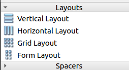
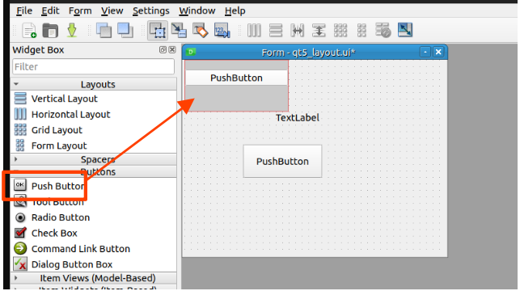
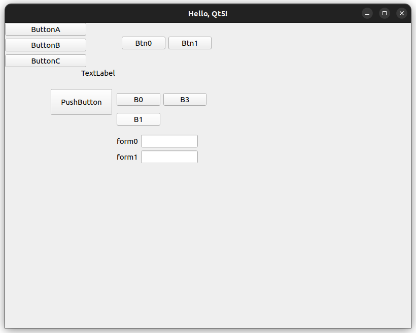
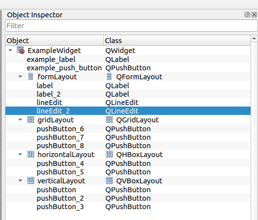

# 2. Layout・ファイル分割

Layoutは、ウィジェットの配置を管理するための仕組みです。Layoutを使用することで、ウィジェットの配置を柔軟に変更することができます。

Qt Designerを使用して自由に配置してみましょう。

### Layoutの設定

[1. Qt5 Hello World!](../01_qt5_hello_world/README.md)と同様に、Qt Designerを起動して、UIを作成します。

左側のWidget Boxに、「Layouts」があります。これらから適切なLayoutを選択して配置します。



それぞれ役割が異なり、Layoutの中にさらにLayoutを配置することもできます。

| Layout | 説明 |
|:--|:--|
| QVBoxLayout | 垂直方向にウィジェットを配置します。 |
| QHBoxLayout | 水平方向にウィジェットを配置します。 |
| QGridLayout | グリッド状にウィジェットを配置します。 |
| QFormLayout | ラベルとエディットボックスをペアで配置します。 |

LayoutsもWidgetと同様に、ドラッグ&ドロップで配置します。
Layoutsの中にWidgetを近づけると、配置される位置がハイライトされるので、適切な位置でマウスを離すと配置されます。



とりあえず、適当に配置してみました。uiの名前に沿ってコードを記述すれば、これらのウィジェットは自動で動作します。



右側のタブ「Object Inspector」で配置したLayoutを確認すると、次のようになります。



<br>

## コード（ファイル分割編）

このuiファイルでも、前回のコードでそのまま動きますが、今回はファイル分割を行います。

### ファイル構成

このチュートリアルでは、Classごとにファイルを分割するようにします。
分割ルールはこれに従う必要はないので、自分の好みに合わせて変更してください。

```bash
.
├── CMakeLists.txt
├── README.md
└── src
    ├── main.cpp
    ├── mainwindow
    │   ├── mainwindow.cpp
    │   └── mainwindow.hpp
    └── widget
        ├── qt5_layout.ui
        ├── widget.cpp
        └── widget.hpp

3 directories, 8 files
```

<br>

### CMakelists.txt

mainwindow.cpp、widget.cpp、main.cppは読めば1を単に分割しただけなので、ここではCMakeLists.txtのみを示します。

```cmake
# cmakeの最小要件。ここでは、3.5以上を指定
cmake_minimum_required(VERSION 3.5)
# project名
project(qt5_layout)

# UIファイルを自動で変換する設定
set(CMAKE_AUTOUIC ON)

# Qt5を探す (Core, Gui, Widgetsを使う)
find_package(Qt5 REQUIRED COMPONENTS Core Gui Widgets)

set(QT5_LIBS Qt5::Core Qt5::Gui Qt5::Widgets)

# ===== Widget =====
set(TARGET_WIDGET qt5_layout_widget)
include_directories(
    ${CMAKE_CURRENT_SOURCE_DIR}/src/
    # (あまり美しくないが)自動生成されたヘッダファイルのパスを追加
    ${CMAKE_CURRENT_SOURCE_DIR}/build/${TARGET_WIDGET}_autogen/include
)
add_library(${TARGET_WIDGET}
    src/widget/qt5_layout.ui 
    src/widget/widget.cpp)
target_link_libraries(${TARGET_WIDGET} ${QT5_LIBS})

# ==== MainWindow ====
add_library(qt5_layout_mainwindow
    src/mainwindow/mainwindow.cpp)
target_link_libraries(qt5_layout_mainwindow qt5_layout_widget ${QT5_LIBS})

# ==== Executable ====
add_executable(qt5_layout_exec
    src/main.cpp)
target_link_libraries(qt5_layout_exec qt5_layout_mainwindow ${QT5_LIBS})
```

<br>

uiファイルは同じディレクトリに入れてコンパイルする必要があるという制約を回避するために、少しだけ工夫しています。

`qt5_layout_widget` というウィジェットライブラリを作成したときに、そのUI定義は `build/qt5_layout_widget_autogen/include` に出力されます。これをincludeディレクトリに追加することで、自動生成されたヘッダファイルを他のファイルから参照できるようにしています。

```cmake
set(TARGET_WIDGET qt5_layout_widget)
include_directories(
    ${CMAKE_CURRENT_SOURCE_DIR}/src/
    # (あまり美しくないが)自動生成されたヘッダファイルのパスを追加
    ${CMAKE_CURRENT_SOURCE_DIR}/build/${TARGET_WIDGET}_autogen/include
)
add_library(${TARGET_WIDGET}
    src/widget/qt5_layout.ui 
    src/widget/widget.cpp)
```

ファイルを分割してライブラリとしてリンクさせることで、変更した箇所だけ再ビルドされます。

<br>
