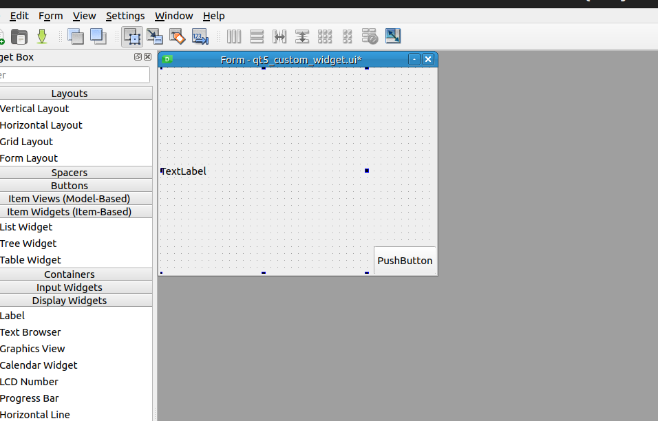
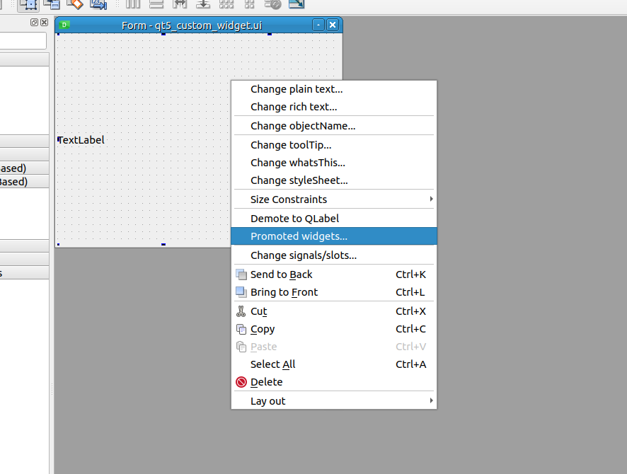
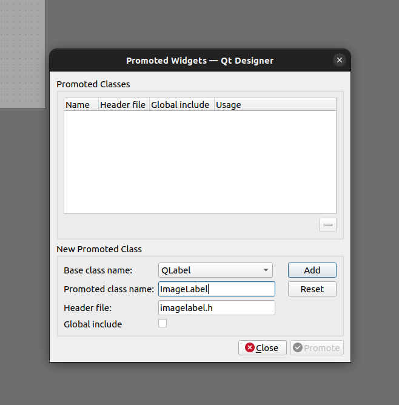
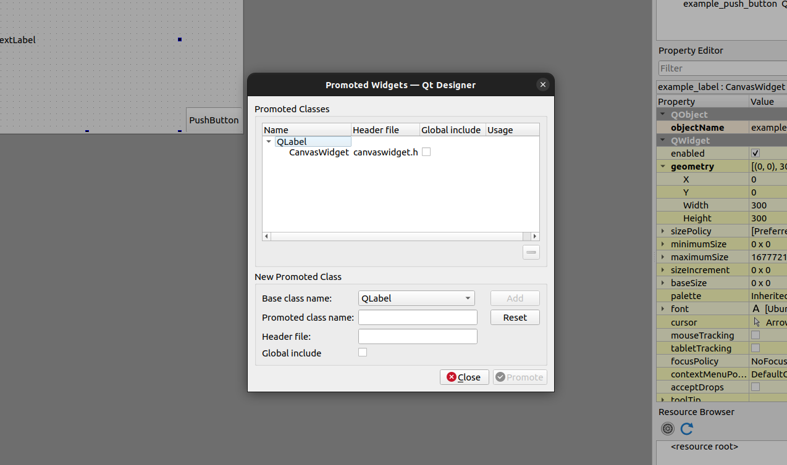
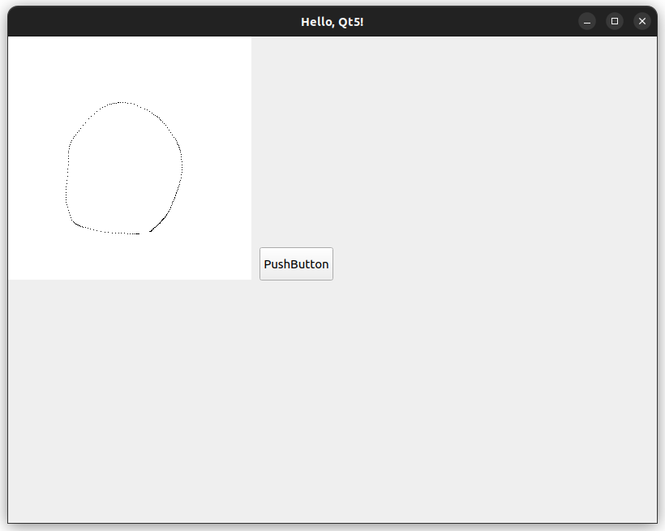

# 3. ウィジェットのカスタマイズ

GUIの作成を進めていくうちに、ウィジェット自体に機能を追加したくなることがあります。

Qtのウィジェットは、継承を使ってカスタマイズすることができます。
これをうまく使うことで、動作の影響範囲がわかりやすくなり、保守性が向上します。

ここでは、シンプルなペイントアプリケーションを作成しながら、ウィジェットのカスタマイズ方法を学びます。

## Qt Designerでカスタムウィジェットを作成する

Qt Designerでは、デフォルトのウィジェットのみ用意されていますが、カスタムウィジェットとして指定することもできます。

まずは、[1. Qt5 Hello World!](../01_qt5_hello_world/README.md) のUIファイルを開き、TextLabelの位置を調整します。

寸法は300x300に設定します。



次に、TextLabelをクリックして右クリックし、 `Promote to...` を選択します。




`Promote widgets...` を選択すると、以下のダイアログが表示されます。

`Promoted class name:` にカスタムウィジェットのクラス名を入力します。クラス名を入力すると、`Header file` にはヘッダファイルのパスが自動的に入力されます。

`Global include` のチェックは外しておきます。

> 画像内では、 `ImageLabel` ですが、実際には `CanvasWidget` と入力しました。



`Add` ボタンをクリックすると、 `Promoted Widgets` に追加されます。



変更したら、 `Promote` ボタンをクリックしてダイアログを閉じ、UIファイルを保存します。

保存先は、 `src/widget/qt5_custom_widget.ui` とします。

## カスタムウィジェットの実装

カスタムウィジェットの実装は、以下の手順で行います。

1. カスタムウィジェットのクラスを作成する
2. ビルドシステムにカスタムウィジェットのヘッダファイルを追加する
3. widget.cppにカスタムウィジェットを含めたUIの挙動を実装する

<br>

今回のディレクトリ構造は以下の通りです。

```bash
.
├── CMakeLists.txt
├── README.md
└── src
    ├── custom_widget # new
    │   └── CanvasWidget
    │       ├── canvaswidget.cpp
    │       └── canvaswidget.h
    ├── main.cpp
    ├── mainwindow
    │   ├── mainwindow.cpp
    │   └── mainwindow.hpp
    └── widget
        ├── qt5_custom_widget.ui # updated
        ├── widget.cpp
        └── widget.hpp

5 directories, 10 files
```

### 1. カスタムウィジェットのクラスを作成する

`CanvasWidget` クラスを作成します。

ヘッダーファイル名は、Qt Designerで指定したものと同じにします。

```cpp

#ifndef CUSTOM_WIDGET_IMAGELABEL_IMAGE_LABEL_HPP_
#define CUSTOM_WIDGET_IMAGELABEL_IMAGE_LABEL_HPP_

#include <QLabel>
#include <QPixmap>
#include <QImage>
#include <QMouseEvent>


class CanvasWidget : public QLabel{
public:
    explicit CanvasWidget(QWidget *parent);
    ~CanvasWidget() = default;

    void drawPoint(int x, int y);
    void reset(const uint32_t size);

    void mousePressEvent(QMouseEvent *event) override;
    void mouseMoveEvent(QMouseEvent *event) override;

private:
    QPixmap loaded_image_;
    QLabel *image_window_;
};


#endif // CUSTOM_WIDGET_IMAGELABEL_IMAGE_LABEL_HPP_
```

CanvasWidgetの実装は以下の通りです。

ここでは、マウスの左クリックとドラッグで描画する機能を実装しています。

| メソッド | 説明 | 基底クラスのオーバーライド |
|:---|:---|:---|
| `CanvasWidget(QWidget *parent)` | コンストラクタ | |
| `drawPoint(int x, int y)` | 座標(x, y)に点を描画する | |
| `reset(const uint32_t size)` | キャンバスをsize x sizeの白い画像にリセットする | |
| `mousePressEvent(QMouseEvent *event)` | マウスの左クリックイベント | ✅ |
| `mouseMoveEvent(QMouseEvent *event)` | マウスの移動イベント | ✅ |


<br>

```cpp

#include "custom_widget/CanvasWidget/canvaswidget.h"

CanvasWidget::CanvasWidget(QWidget *parent) : QLabel(parent){
    loaded_image_ = QPixmap(100, 100);
    loaded_image_.fill(Qt::white);
    setPixmap(loaded_image_);
}

void CanvasWidget::drawPoint(int x, int y){
    QImage image = loaded_image_.toImage();
    image.setPixelColor(x, y, Qt::black);

    setPixmap(QPixmap::fromImage(image));
    loaded_image_ = QPixmap::fromImage(image);
}

void CanvasWidget::reset(const uint32_t size){
    loaded_image_ = QPixmap(size, size);
    loaded_image_.fill(Qt::white);
    setPixmap(loaded_image_);
}

void CanvasWidget::mousePressEvent(QMouseEvent *event){
    if(event->button() == Qt::LeftButton){
        drawPoint(event->x(), event->y());
    }
}

void CanvasWidget::mouseMoveEvent(QMouseEvent *event){
    if(event->buttons() & Qt::LeftButton){
        drawPoint(event->x(), event->y());
    }
}
```

### 2. ビルドシステムにカスタムウィジェットのヘッダファイルを追加する

custom_widget自体のビルドと、widgetのビルドにカスタムウィジェットのヘッダファイルをincludeします。

```makefile
# ===== Custom Widget ===== new
add_library(custom_widget
    src/custom_widget/CanvasWidget/canvaswidget.cpp)
target_link_libraries(custom_widget ${QT5_LIBS})
set(QT5_LIBS ${QT5_LIBS} custom_widget)

# ===== Widget =====
set(TARGET_WIDGET qt5_custom_widget_widget)
include_directories(
    ${CMAKE_CURRENT_SOURCE_DIR}/src/
    # 自作のWidgetのヘッダファイルのパスを追加 new
    ${CMAKE_CURRENT_SOURCE_DIR}/src/custom_widget/CanvasWidget/
    # (あまり美しくないが)自動生成されたヘッダファイルのパスを追加
    ${CMAKE_CURRENT_BINARY_DIR}/${TARGET_WIDGET}_autogen/include
)
add_library(${TARGET_WIDGET}
    src/widget/qt5_custom_widget.ui 
    src/widget/widget.cpp
    ${WIDGETS}
)
target_link_libraries(${TARGET_WIDGET} ${QT5_LIBS})
set(QT5_LIBS ${QT5_LIBS} ${TARGET_WIDGET})
```

### 3. widget.cppにカスタムウィジェットを含めたUIの挙動を実装する

`widget.cpp` に `CanvasWidget` の挙動を追加します。

ボタンに対応した挙動 `ui.example_label->reset(300);` 以外は、 `CanvasWidget` クラスが自動的に処理してくれます。

```cpp
#include "widget/widget.hpp"

namespace qt5_custom_widget
{

ExampleWidget::ExampleWidget(QWidget * parent = nullptr)
: QWidget(parent)
{
  // UIの初期化
  ui.setupUi(this);
  // ボタンがクリックされたときの処理を設定
  connect(ui.example_push_button, &QPushButton::clicked, this, &ExampleWidget::onPushButtonClicked);

  ui.example_label->reset(300);
}

void ExampleWidget::onPushButtonClicked()
{
  ui.example_label->reset(300);
}

} // namespace qt5_custom_widget
```

実行すると、マウスの左クリックとドラッグで描画することができます。

PushButtonをクリックすると、キャンバスがリセットされます。




