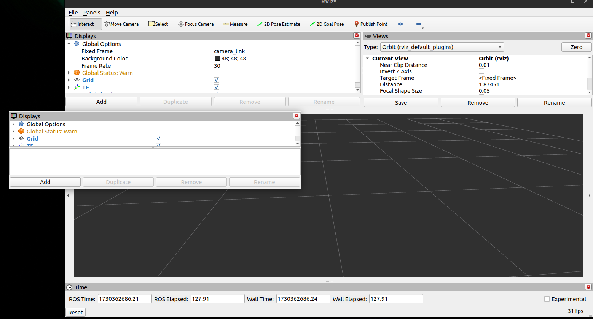

# 10. Rviz2への移植

ROS 2のGUIツールであるRviz2には、Qtウィジェットを埋め込むことができます。

このチュートリアルでは、Qt5で作成したウィジェットをRviz2に埋め込む方法を解説します。

### Rviz2とは

Rviz2は、ROS 2のGUIツールの1つで、3D可視化ツールです。センサデータやロボットの状態を3Dで表示でき、ロボットの動作確認やデバッグに利用されます。

さまざまな機能を内包しており、ユーザはプラグインを追加することでその機能を拡張することができます。


Rviz2にはQtウィジェットを配置可能なスペース（①〜④）が用意されており、このスペースにQtウィジェットを埋め込むことができます。

一つの区画の中に複数のウィジェットを配置することも可能です。


また、Qtウィジェットを外に出すこともできます。



## Rviz2向けプラグインの作成

ディレクトリ構造を以下に示します。

Rviz2向けのプラグインはROS 2パッケージとしてビルドするため、ROS 2のパッケージ構造に従っています。

```bash
.
├── CMakeLists.txt
├── package.xml # new
├── plugins_description.xml # new
├── README.md
└── src
    └── widget
        ├── rviz2panel_hello.ui
        ├── widget.cpp
        └── widget.hpp

2 directories, 7 files
```

### 継承クラスの変更

Rviz2向けのプラグインを作成するためには、`rviz_common::Panel`クラスを継承する必要があります。

[2. Layout・ファイル分割](../02_qt5_layout/)のwidgetを参考に、`rviz_common::Panel`クラスを継承したクラスに変更します。

<br>

`rviz_common::Panel` クラスを継承すると、次の関数をオーバーライドすることができます。特に設定しなかった場合は、なにもしません。

| 関数名| 説明|
|---|---|
| onInitialize()| DisplayContextが利用可能な状態での初期化を行う|
| getName()| 名前を返す|
| setName()| 名前を設定する|
| getDescription()| パネルの説明を返す|
| setDescription()| パネルの説明を設定する（通常、ファクトリによって呼ばれる）|
| getClassId()| インスタンスを作成する際に使用されたクラスIDを返す| setClassId()で設定されたIDを返す |
| setClassId()| インスタンスを作成する際に使用するクラスIDを設定する（通常、ファクトリによって呼ばれる）|
| load()| 設定データをロードする（パネルの名前を読み込む）|
| save()| 設定データを保存する（パネルの名前とクラスIDを保存する）|

<br>

```cpp
// ===== 追記 =====

// Q_MOC_RUN is defined when this file is processed by moc
#ifndef Q_MOC_RUN
#include <rviz_common/panel.hpp>

#include <rviz_common/config.hpp>
#include <rviz_common/display_context.hpp>
#endif
// =================
namespace rviz2panel_hello
{
...

// ===== 変更前 =====
// class ExampleWidget : public QWidget
// ----- 変更後 -----
class ExampleWidget : public rviz_common::Panel
// =================
{
    ...
```

```cpp
namespace rviz2panel_hello
{
ExampleWidget::ExampleWidget(QWidget * parent = nullptr)
// ===== 変更前 =====
// : QWidget(parent)
// ----- 変更後 -----
: rviz_common::Panel(parent)
// =================
{
    ...
}
...

} // namespace rviz2panel_hello
// ===== 追記 =====
#include <pluginlib/class_list_macros.hpp>
PLUGINLIB_EXPORT_CLASS(rviz2panel_hello::ExampleWidget, rviz_common::Panel)
```

UIは、[1. Qt5 Hello World!](../01_qt5_hello_world/README.md)のものをそのまま使用します。

### プラグインの登録

プラグインをRviz2に登録するために、 `plugins_description.xml`ファイルを作成します。

このxmlは、ROS 2のPluginlibの仕様に従って記述します。

```xml
<library path="rviz2panel_hello">
  <class name="rviz2panel_hello/ExampleWidget" type="rviz2panel_hello::ExampleWidget" base_class_type="rviz_common::Panel">
    <description>button panel</description>
  </class>
</library>
```

ROSパッケージとしてビルドするために、`package.xml` と `CMakeLists.txt` を作成します。

<!-- `ament_cmake_auto` をビルド依存関係の解消 -->
ビルド依存関係の解消には、`ament_cmake_auto`を使用します。これを使用することで、CMakeLists.txtの記述を簡略化することができます。

```xml
<?xml version="1.0"?>
<?xml-model href="http://download.ros.org/schema/package_format3.xsd" schematypens="http://www.w3.org/2001/XMLSchema"?>
<package format="3">
  <name>rviz2panel_hello</name>
  <version>0.0.0</version>
  <description>rviz2panel_hello pkg</description>
  <maintainer email="xxx@yyy.zzz">Ar-Ray-code</maintainer>
  <license>Apache-2.0</license>

  <buildtool_depend>ament_cmake_auto</buildtool_depend>

  <depend>rviz_common</depend>
  <depend>qtbase5-dev</depend>

  <test_depend>ament_lint_auto</test_depend>
  <test_depend>ament_lint_common</test_depend>

  <export>
    <build_type>ament_cmake</build_type>
  </export>
</package>
```

```makefile
# cmakeの最小要件。ここでは、3.25以上を指定
cmake_minimum_required(VERSION 3.25)
# project名
project(rviz2panel_hello)

# UIファイルを自動で変換する設定
set(CMAKE_AUTOUIC ON)

# 依存関係の解消
find_package(ament_cmake_auto REQUIRED)
find_package(Qt5 REQUIRED COMPONENTS Core Gui Widgets)
ament_auto_find_build_dependencies()

set(QT5_LIBS Qt5::Core Qt5::Gui Qt5::Widgets)

# ===== Widget =====
include_directories(
    ${CMAKE_CURRENT_SOURCE_DIR}/src/
)
ament_auto_add_library(rviz2panel_hello SHARED
    src/widget/rviz2panel_hello.ui # 1のUIファイルを流用
    src/widget/widget.cpp)
target_link_libraries(rviz2panel_hello ${QT5_LIBS})

# Pluginの登録
pluginlib_export_plugin_description_file(rviz_common plugins_description.xml)

if(BUILD_TESTING)
  find_package(ament_lint_auto REQUIRED)
  set(ament_cmake_copyright_FOUND TRUE)
  set(ament_cmake_cpplint_FOUND TRUE)
  ament_lint_auto_find_test_dependencies()
endif()

ament_auto_package()
```

これで、プラグインの作成が完了しました。

## プラグインのビルド

```bash
cd <path to target_ros2_ws>/
source /opt/ros/humble/setup.bash

colcon build --packages-select rviz2panel_hello
```

## Rviz2へのプラグインの追加

ビルドが完了したら、Rviz2にプラグインを追加します。

```bash
source <path to target_ros2_ws>/install/setup.bash
rviz2
```

Rviz2が起動したら、左上の「Panels」から「Add New Panel」を選択し、先程ビルドしたプラグインを選択します。


[1. Qt5 Hello World!](../01_qt5_hello_world/)で作成したプラグインがRviz2に追加されました。


非表示の際は、ウィジェット右上の「×」をクリック、削除する場合は「Panels→Delete Panel」の順に選択し、削除するウィジェット名を選択します。
